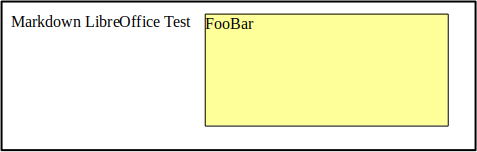

{title:Test of all items}

<!-- ======================================= -->
{toc}

# Lists

## List of Images
{loi}

## List of Abbreviations
{loa}

## List of References
{lor}

## List of Artefacts
{loa:artefact}

## List of Milestones
{loa:milestone}

## List of Bugs
{loa:bug}

## List of Issues
{loa:issue}

## List of Codes
{loc}

<!-- ======================================= -->
# Images [img][#images]

: Test image of opendocument file using png as image format. 1

: Test image of opendocument file using png as image format. 2

# Abbreviations [abbrev][#abbreviations]

{a:[GNU][GNU's not Unix!][GNU is a recursive acronym for "GNU's Not Unix!", chosen because GNU's design is Unix-like, but differs from Unix by being free software and containing no Unix code.]}

{abbr:[BSD][Berkeley Software Distribution][The Berkeley Software Distribution or Berkeley Standard Distribution BSD is a discontinued operating system based on Research Unix, developed and distributed by the Computer Systems Research Group at the University of California, Berkeley.]}

# References
Links to [Images](#images) and [Abbreviations](#abbreviations) and [Artefacts](#artefacts) and [Paragraph duplicated](#paragraph_duplicated).
Links to [Images included](#images_included) and [Abbreviations includeed](#abbreviations_included) and [Artefacts included](#artefacts_included) and [Paragraph duplicated](#paragraph_duplicated).
Broken link to [Broken Link](#broken_link).
Link with no reference [Missing Reference](#missing_reference).

# Artefacts [artf][#artefacts]
Also {artefact:3} is the same as {issue:1} and will resolve {bug:1}.
Note futher that {milestone:beta} requires to fix all the bugs and issues and artefacts from above.

# Pargraphs [paradup][#paragraph_duplicated]
## test separator 1
Id pariatur doloribus aut animi commodi. Voluptatem distinctio possimus vero temporibus totam ratione necessitatibus delectus. Consequuntur sapiente quidem accusamus. Quidem sunt qui pariatur.

Est aliquam asperiores est expedita numquam molestiae. Voluptates et quas odio magni ipsum excepturi. Quidem distinctio autem dolor quis autem enim earum. Aliquid omnis sint eos rerum. Repudiandae architecto vitae ipsam in consequatur. Dolores quaerat qui ad.

Tempora sunt est odio dolorem aut earum deleniti maiores. Vel facilis reiciendis hic magnam. Adipisci quaerat molestias ipsum. Commodi aut illum vero ipsum dignissimos velit esse. Qui omnis voluptates earum.

Pariatur at optio voluptatem minima voluptates. Ea consequuntur vel ut nostrum et nostrum. Laudantium nulla quo quisquam neque.

Ullam impedit quos ipsum nulla neque. Culpa quas voluptas officiis itaque. Est reprehenderit ipsam id. Praesentium dignissimos deleniti porro ex. Blanditiis autem cupiditate porro dolorem possimus iste fugit. Aut iusto ea placeat adipisci itaque.

## test separator 2
Id pariatur doloribus aut animi commodi. Voluptatem distinctio possimus vero temporibus totam ratione necessitatibus delectus. Consequuntur sapiente quidem accusamus. Quidem sunt qui pariatur.
Est aliquam asperiores est expedita numquam molestiae. Voluptates et quas odio magni ipsum excepturi. Quidem distinctio autem dolor quis autem enim earum. Aliquid omnis sint eos rerum. Repudiandae architecto vitae ipsam in consequatur. Dolores quaerat qui ad.
Tempora sunt est odio dolorem aut earum deleniti maiores. Vel facilis reiciendis hic magnam. Adipisci quaerat molestias ipsum. Commodi aut illum vero ipsum dignissimos velit esse. Qui omnis voluptates earum.
Pariatur at optio voluptatem minima voluptates. Ea consequuntur vel ut nostrum et nostrum. Laudantium nulla quo quisquam neque.
Ullam impedit quos ipsum nulla neque. Culpa quas voluptas officiis itaque. Est reprehenderit ipsam id. Praesentium dignissimos deleniti porro ex. Blanditiis autem cupiditate porro dolorem possimus iste fugit. Aut iusto ea placeat adipisci itaque.

## test separator 3
Id pariatur doloribus aut animi commodi. Voluptatem distinctio possimus vero temporibus totam ratione necessitatibus delectus. Consequuntur sapiente quidem accusamus. Quidem sunt qui pariatur.
Est aliquam asperiores est expedita numquam molestiae. Voluptates et quas odio magni ipsum excepturi. Quidem distinctio autem dolor quis autem enim earum. Aliquid omnis sint eos rerum. Repudiandae architecto vitae ipsam in consequatur. Dolores quaerat qui ad.

Tempora sunt est odio dolorem aut earum deleniti maiores. Vel facilis reiciendis hic magnam. Adipisci quaerat molestias ipsum. Commodi aut illum vero ipsum dignissimos velit esse. Qui omnis voluptates earum.
Pariatur at optio voluptatem minima voluptates. Ea consequuntur vel ut nostrum et nostrum. Laudantium nulla quo quisquam neque.
Ullam impedit quos ipsum nulla neque. Culpa quas voluptas officiis itaque. Est reprehenderit ipsam id. Praesentium dignissimos deleniti porro ex. Blanditiis autem cupiditate porro dolorem possimus iste fugit. Aut iusto ea placeat adipisci itaque.

## test separator 3
Id pariatur doloribus aut animi commodi. Voluptatem distinctio possimus vero temporibus totam ratione necessitatibus delectus. Consequuntur sapiente quidem accusamus. Quidem sunt qui pariatur.
Est aliquam asperiores est expedita numquam molestiae. Voluptates et quas odio magni ipsum excepturi. Quidem distinctio autem dolor quis autem enim earum. Aliquid omnis sint eos rerum. Repudiandae architecto vitae ipsam in consequatur. Dolores quaerat qui ad.
Also {artefact:3} is the same as {issue:1} and will resolve {bug:1}.
Note futher that {milestone:beta} requires to fix all the bugs and issues and artefacts from above.
Tempora sunt est odio dolorem aut earum deleniti maiores. Vel facilis reiciendis hic magnam. Adipisci quaerat molestias ipsum. Commodi aut illum vero ipsum dignissimos velit esse. Qui omnis voluptates earum.
Pariatur at optio voluptatem minima voluptates. Ea consequuntur vel ut nostrum et nostrum. Laudantium nulla quo quisquam neque.
Ullam impedit quos ipsum nulla neque. Culpa quas voluptas officiis itaque. Est reprehenderit ipsam id. Praesentium dignissimos deleniti porro ex. Blanditiis autem cupiditate porro dolorem possimus iste fugit. Aut iusto ea placeat adipisci itaque.

## Includes

### Includes relative
#include[+0]{all_test_include.md}

### Include absolute
#include[3]{all_test_include.md}

### Include relative to previous
#include{all_test_include.md}

## Descriptions
* **Test 1**: is a simple test case.
  Where it is simple than others

* **Test 2**: is a more complex test case.

* **Test 3**: is a very complex test case.
  We need more work on this one

  * **Test 3a**: is a very complex test case.
    We need more work on this one

    * **Test 3b**: is a very complex test case.
      We need more work on this one

  * **Lorem**:
    Id pariatur doloribus aut animi commodi. Voluptatem distinctio possimus vero temporibus totam ratione necessitatibus delectus. Consequuntur sapiente quidem accusamus. Quidem sunt qui pariatur.

    Est aliquam asperiores est expedita numquam molestiae. Voluptates et quas odio magni ipsum excepturi. Quidem distinctio autem dolor quis autem enim earum. Aliquid omnis sint eos rerum. Repudiandae architecto vitae ipsam in consequatur. Dolores quaerat qui ad.

    Tempora sunt est odio dolorem aut earum deleniti maiores. Vel facilis reiciendis hic magnam. Adipisci quaerat molestias ipsum. Commodi aut illum vero ipsum dignissimos velit esse. Qui omnis voluptates earum.

    Pariatur at optio voluptatem minima voluptates. Ea consequuntur vel ut nostrum et nostrum. Laudantium nulla quo quisquam neque.

    Ullam impedit quos ipsum nulla neque. Culpa quas voluptas officiis itaque. Est reprehenderit ipsam id. Praesentium dignissimos deleniti porro ex. Blanditiis autem cupiditate porro dolorem possimus iste fugit. Aut iusto ea placeat adipisci itaque.

# Comments
Hello world! % this is a comment 1
% this is a comment 2
  % this is a comment 3
Hello earth!
%
Hello!
%
%
Hello again!
%

%
Hi!

# Codes
The code is below.

## Standalone code block
```
standalone
code
block
```

## Standalone code block with space at the beginning
```

standalone
code
block
```

## Standalone code block with space in the middle
```
standalone

code
block
```

## Standalone code block with space at end
```
standalone
code
block

```

## Code
``` [Yet another Code 1]
a = a + 1
b = b * 2
bla
s {artefact:1}
{artefact:2}
{artefact:3} s
bla2 {artefact:4} foo2
bla3 {artefact:5} foo3 {artefact:6} bar3
foo
bar
```

## Code starting with artefact
``` [Yet another Code 2]
{artefact:1}
bla2 {artefact:2} foo2
bla3 {artefact:3} foo3 {artefact:4} bar3
foo
bar
```

## Code ending with artefact
``` [Yet another Code 3]
bla2 {artefact:2} foo2
bla3 {artefact:3} foo3 {artefact:4} bar3
foo
bar
{artefact:5}
```

## Code starting and ending with artefact
``` [Yet another Code 4]
{artefact:1}
bla2 {artefact:2} foo2
bla3 {artefact:3} foo3 {artefact:4} bar3
foo
bar
{artefact:5}
```

## Code starting and ending with space plus artefact
``` [Yet another Code 5]

{artefact:1}
bla2 {artefact:2} foo2
bla3 {artefact:3} foo3 {artefact:4} bar3

foo
bar
{artefact:5}

```

## Code starting with artefact with space line
``` [Yet another Code 6]
{artefact:1}
bla2 {artefact:2} foo2
bla3 {artefact:3} foo3 {artefact:4} bar3

foo
bar
```

## Code with space lines
``` [Yet another Code 7]
bla2

foo

bar
```

## Code element without decoding
<!--{code:code block direct}-->
```
test
test2
test3
```

## Inline code
Inline code `c = d+e` test. [inline code][#inline_code].

## Codes with links
``` [Yet another Code 8]
{artefact:1}
bla2 {artefact:2} foo2
bla3 {artefact:3} foo3 {artefact:4} bar3 [Link to somewhere inside code](#inline_code)

foo
bar
```

# Newlines

## Text before code
blabla
```
some code
```

## Title before code
```
some code
```

## Comment before code
blabla
%
```
some code
```

## Newline before code
blabla

```
some code
```

## Text before list
blabla
* some list 1
* some list 2

## Title before list
* some list 1
* some list 2

## Comment before list
blabla
%
* some list 1
* some list 2

## Newline before list
blabla

* some list 1
* some list 2
