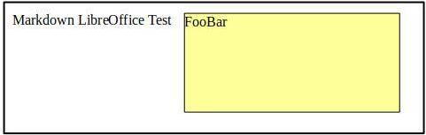
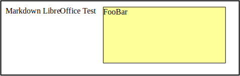

{loi}

<!--

We need: Link title description
: description
-->

# All
More text.
: Test image of opendocument file using png as image format. 1

More text.
: Test image of opendocument file using jpg as image format. 2

More text.

# Missing alternative text
More text.
!(content/test.odt.png "title: test odt png 3"): Test image of opendocument file using png as image format. 3

More text.
!(content/test.odt.jpg "title: test odt jpg 4"): Test image of opendocument file using jpg as image format. 4

More text.

# Missing hoover text
: Test image of opendocument file using png as image format. 5

: Test image of opendocument file using jpg as image format. 6

# Missing alternative text and hover text
More text.
!(content/test.odt.png): Test image of opendocument file using png as image format. 7

More text.

!(content/test.odt.jpg): Test image of opendocument file using jpg as image format. 8

More text.

# Missing image base document
: Test image of opendocument file using png as image format. 9

: Test image of opendocument file using jpg as image format. 10

# Missing image
: Test image of opendocument file using png as image format. 11

: Test image of opendocument file using jpg as image format. 12

# Missing all
: Test image of opendocument file using png as image format. 13

: Test image of opendocument file using jpg as image format. 14

# No description
bla

: 

# Simple image
bla

: Simple image description 15

bla2

# Simple image before
bla

: 

bla2

<!--
=>

Description (source link if exists):
<image>

+list of images linked table using sections for numbering ? Selective section depth for numbering or simple counting ?
-->

